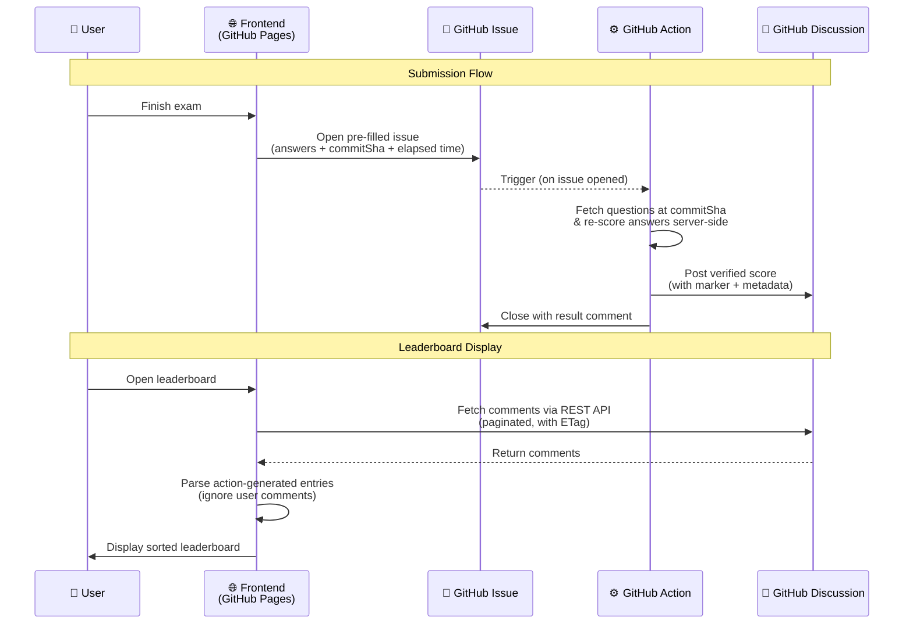

# iSAQB CPSA-F Mock Exam

A web-based practice exam for the **iSAQB Certified Professional for Software Architecture — Foundation Level (CPSA-F)**.

Questions are sourced from the [official iSAQB examination question catalog](https://github.com/isaqb-org/foundation-exam-questions).

## Take the exam

You can take the exam [here](https://enyineer.github.io/isaqb-exam/). Please report any issues in this repositories issue tracker.

## Features

- 🎯 Pick & category question types with iSAQB scoring rules
- 🔀 Shuffled answer order per attempt to prevent pattern memorization
- ⏱️ Active time tracking (pauses when browser is closed)
- 💾 Auto-saves progress to localStorage — refresh without losing state
- 🚩 Flag questions for review — confirmation prompt before finishing with flagged questions
- 📝 Per-question notes for your lecturer — persisted and shown in results + print
- 🖨️ Print/export results for your lecturer (including notes)
- 🔵 Skipped vs wrong answer distinction in results (no penalty for skipped)
- 🏆 Leaderboard — submit scores via GitHub Issues, verified by a GitHub Action
- 🌍 German & English
- 🎨 Multiple color themes + dark mode
- ⌨️ Full keyboard navigation
- 🔗 Hash-based routing — works on GitHub Pages without server config

## Leaderboard Architecture

The leaderboard runs **entirely without a backend** using GitHub's infrastructure as the data layer.

### How It Works



### Components

| Component | Path | Role |
|---|---|---|
| **Submit URL builder** | `src/utils/leaderboard.ts` | Builds a pre-filled GitHub Issue URL with the user's answers, commit SHA, and elapsed time |
| **Score submission script** | `scripts/scoreSubmission.ts` | Server-side scoring: fetches questions at the exact commit, re-scores answers, posts the verified result to the Discussion |
| **GitHub Action workflow** | `.github/workflows/process-leaderboard.yml` | Triggers on issue creation with the `leaderboard-submission` label, runs the scoring script |
| **Issue template** | `.github/ISSUE_TEMPLATE/leaderboard_submit.yml` | Defines the issue structure and auto-applies the label |
| **Leaderboard fetcher** | `src/utils/leaderboard.ts` | Fetches and caches Discussion comments from the GitHub REST API |
| **Leaderboard page** | `src/pages/LeaderboardPage.tsx` | Displays entries with sorting, last-fetched time, and rate-limit warnings |
| **Config** | `src/utils/leaderboardConfig.ts` | Central constants (repo owner, discussion number, API URLs, schema version) |

### Caching Strategy

The frontend uses a **permanent page cache** with intelligent tail fetching to minimize API requests:

1. **Permanent pages**: Full pages (100 comments) are cached forever in `localStorage` with per-page ETags — they only change if a comment is deleted.

2. **Tail fetching**: Only pages after the last known full page are re-fetched (up to 10 pages / 1,000 entries), with a 5-minute TTL.

3. **ETag validation**: On each refresh, the last permanent page's ETag is checked with a conditional request (304 = free, no rate limit cost). If it changed, a backward walk finds the exact invalidation point.

4. **Rate limit fallback**: On 403/429 responses, stale cache is returned with a user-visible warning.

### Leaderboard Setup

1. Create a [GitHub Discussion](https://docs.github.com/en/discussions) for leaderboard entries and **lock it** (the action can still post via the API)
2. Create a `leaderboard-submission` label in the repository
3. Set the `LEADERBOARD_DISCUSSION_ID` repository variable (GraphQL node ID):
   ```bash
   gh api graphql -f query='{ repository(owner:"OWNER", name:"REPO") { discussion(number:N) { id } } }' --jq '.data.repository.discussion.id'
   ```
4. Update constants in `src/utils/leaderboardConfig.ts` if needed

## Tech Stack

React 19 · Vite · Tailwind CSS v4 · Bun · TypeScript · Wouter

## Getting Started

```bash
bun install
bun run dev
```

## Testing

```bash
bun test
```

## Disclaimer

This tool and its author are not affiliated with [iSAQB e.V.](https://www.isaqb.org/)
No guarantee is provided for the correctness of the questions or the test itself.

## License

[MIT](LICENSE.md)
