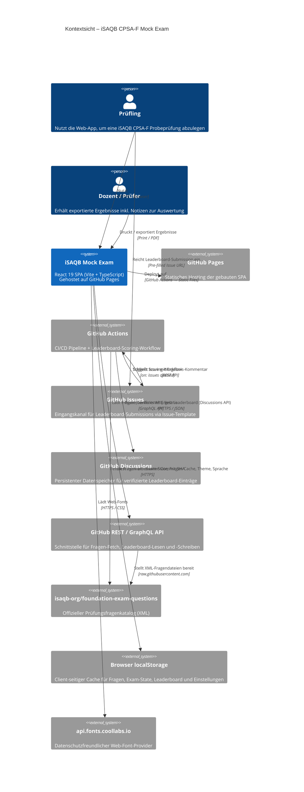

# Kontextsicht — iSAQB CPSA-F Mock Exam

## Erläuterung der Systemgrenzen

| Bereich | Beschreibung |
|---|---|
| **Kernsystem** | React 19 Single-Page-Application mit Vite, TypeScript und Tailwind CSS v4 |
| **Nutzer** | *Prüfling* (nimmt Prüfung ab, reicht Leaderboard-Score ein) und *Dozent/Prüfer* (wertet exportierte Ergebnisse aus) |
| **Datenquelle** | Offizieller iSAQB-Fragenkatalog (`isaqb-org/foundation-exam-questions`) als XML via GitHub API |
| **Leaderboard-Pipeline** | GitHub Issues → GitHub Actions → GitHub Discussions (serverlose Architektur) |
| **Client-Speicher** | `localStorage` für Fragen-Cache (60 Min TTL), Exam-State, Theme und Spracheinstellungen |
| **Hosting** | GitHub Pages (statisch, kein Backend) |
| **Externe Dienste** | `api.fonts.coollabs.io` für datenschutzfreundliche Web-Fonts |
