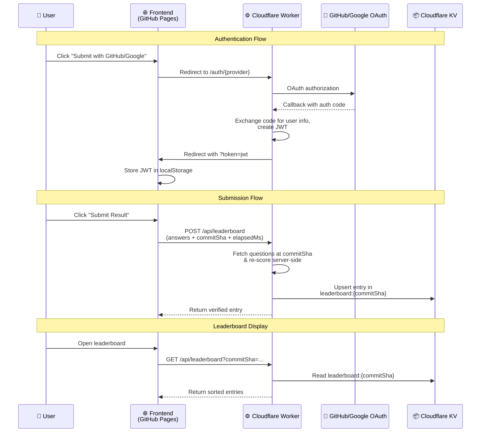

# Leaderboard Architecture

The leaderboard is powered by a **Cloudflare Worker** with **KV storage**, using OAuth for authentication and server-side score verification.

## How It Works

## Components

| Component | Path | Role |
|---|---|---|
| **Worker entry** | `worker/src/index.ts` | Routes requests to API and auth handlers |
| **OAuth handlers** | `worker/src/auth.ts` | GitHub & Google OAuth flows, JWT creation, session management |
| **Leaderboard API** | `worker/src/leaderboard.ts` | Score submission (with Zod validation) and retrieval |
| **JWT utilities** | `worker/src/jwt.ts` | HMAC-SHA256 JWT signing and verification via Web Crypto API |
| **Questions proxy** | `worker/src/questions.ts` | Fetches and caches questions from GitHub, parses XML server-side |
| **CORS** | `worker/src/cors.ts` | Cross-origin headers for frontend ↔ Worker communication |
| **Frontend leaderboard** | `src/utils/leaderboard.ts` | Token management, API calls, local caching |
| **Leaderboard page** | `src/pages/LeaderboardPage.tsx` | Displays entries with sorting and avatar fallbacks |

## Data Model

Leaderboard entries are **sharded by commit SHA** in Cloudflare KV:

- **Key**: `leaderboard:{commitSha}` — one key per question version
- **Value**: JSON array of entries for that question set
- **Upsert**: One entry per user per commit SHA (re-submission replaces the previous entry)

This ensures no single KV value grows unboundedly and naturally groups scores by question version.

## Authentication

- OAuth login via GitHub or Google — used for spam prevention and attribution
- JWT token passed via URL query param after OAuth redirect (avoids cross-origin cookie issues)
- Token stored in `localStorage`, sent as `Authorization: Bearer` header
- Session duration: 7 days

## Worker Secrets

| Secret | Purpose |
|---|---|
| `GITHUB_TOKEN` | Fetch questions from the upstream repo |
| `GITHUB_CLIENT_ID` / `GITHUB_CLIENT_SECRET` | GitHub OAuth |
| `GOOGLE_CLIENT_ID` / `GOOGLE_CLIENT_SECRET` | Google OAuth |
| `JWT_SECRET` | Sign and verify session JWTs |
